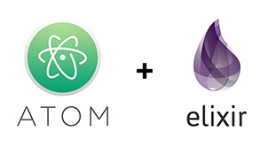
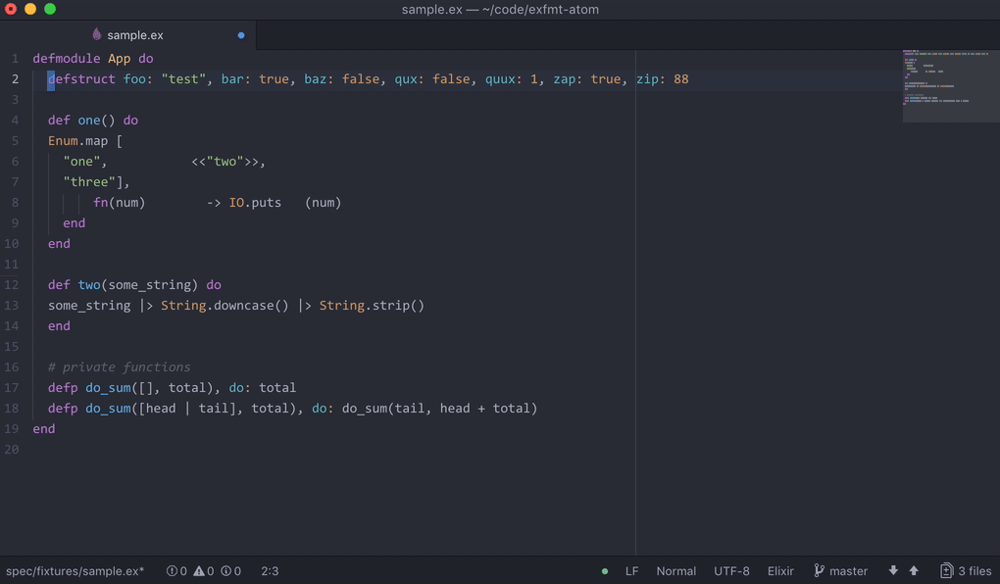

# atom-elixir-formatter package



[](https://travis-ci.org/rgreenjr/atom-elixir-formatter) []()

An Atom package to format Elixir source code.



## Installation

Note that **atom-elixir-formatter** requires Elixir v1.6.0, which is currently unreleased. You will need to download and compile the master branch of Elixir, then provide the absolute path of its `mix` executable in **Mix Executable** in Settings.

Install `atom-elixir-formatter`:

```sh
apm install atom-elixir-formatter
```

## Maintainers

[Ron Green](https://github.com/rgreenjr)
