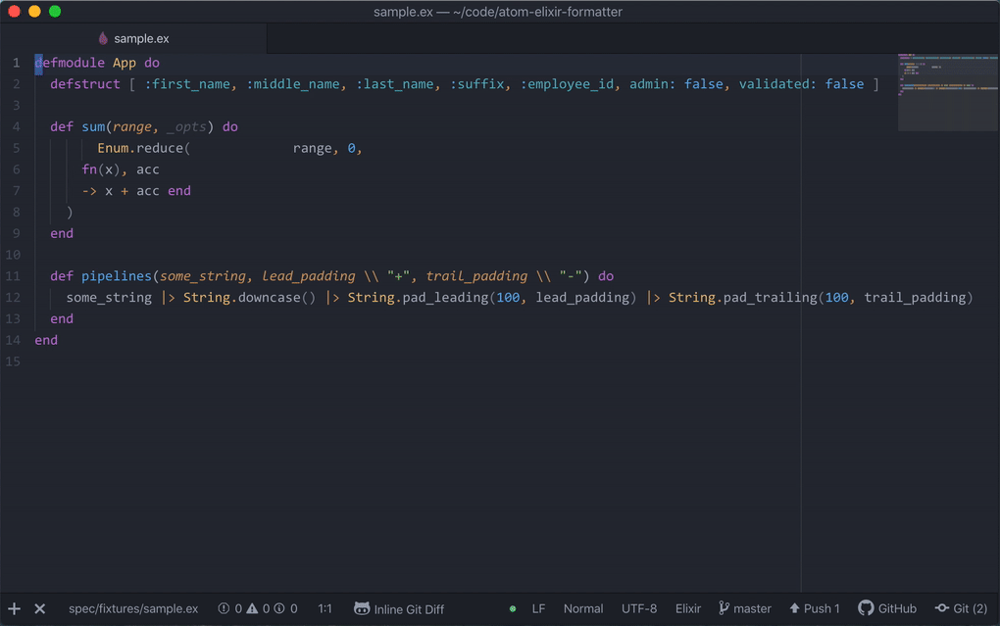
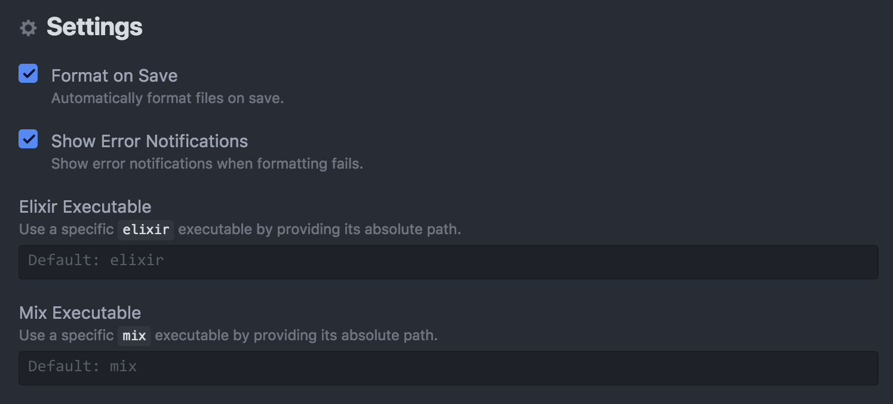

# Atom Elixir Formatter

[](https://travis-ci.org/rgreenjr/atom-elixir-formatter) []()




## Description

Elixir source code formatter for the Atom editor. It automatically formats Elixir code using the new formatter in Elixir 1.6.

## Installation

Note that `atom-elixir-formatter` requires Elixir 1.6, which is currently unreleased. You'll need to download and compile the master branch of Elixir:

```sh
git clone https://github.com/elixir-lang/elixir.git
cd elixir
make clean test
```

> IMPORTANT: `atom-elixir-formatter` recently changed the way it communicates with the Elixir code formatter. It uses the new `-` option that was added to the Elixir master branch on October 17, 2017. This allows formatting via `STDIN`/`STDOUT`, which eliminates the need for temporary files and reduces latency.

> **If you downloaded and compiled the master branch of Elixir prior to that date, you will need to update your local Elixir repo and recompile:**

```sh
# from your local Elixir 1.6 repo
git pull
make clean test
```


Install the `atom-elixir-formatter` package:

```sh
apm install atom-elixir-formatter
```

Restart Atom and change the `atom-elixir-formatter` settings for **Elixir Executable** and **Mix Executable** to the absolute paths of the `elixir` and `mix` executables.



## Usage

Elixir files are formatted automatically on save. This can be disabled in Settings.

You can manually format sections of code using the keyboard shortcut <kbd>CTRL</kbd> + <kbd>ALT</kbd> + <kbd>F</kbd>.

## Maintainers

[Ron Green](https://github.com/rgreenjr)
